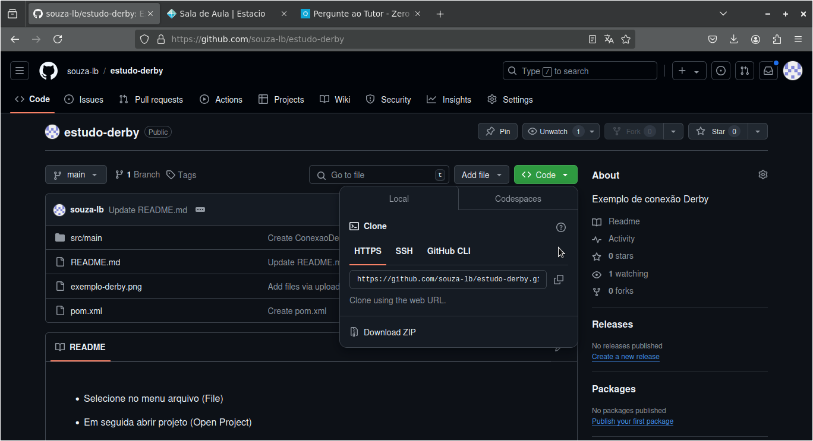
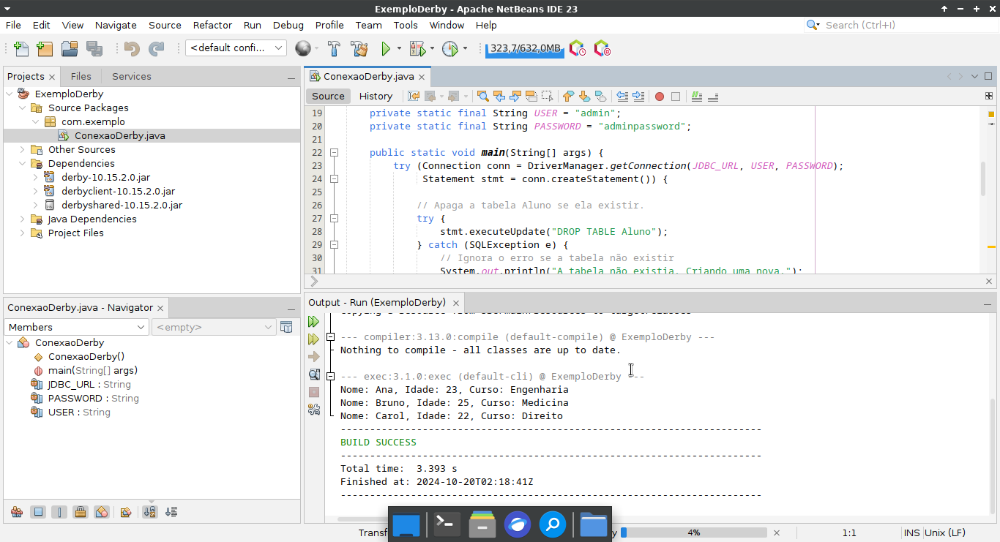
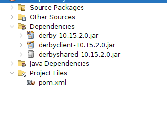
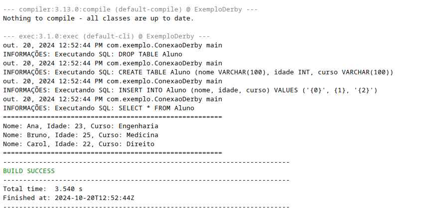
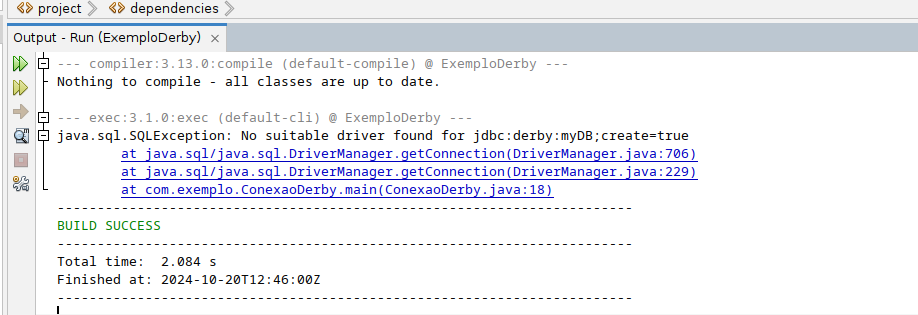
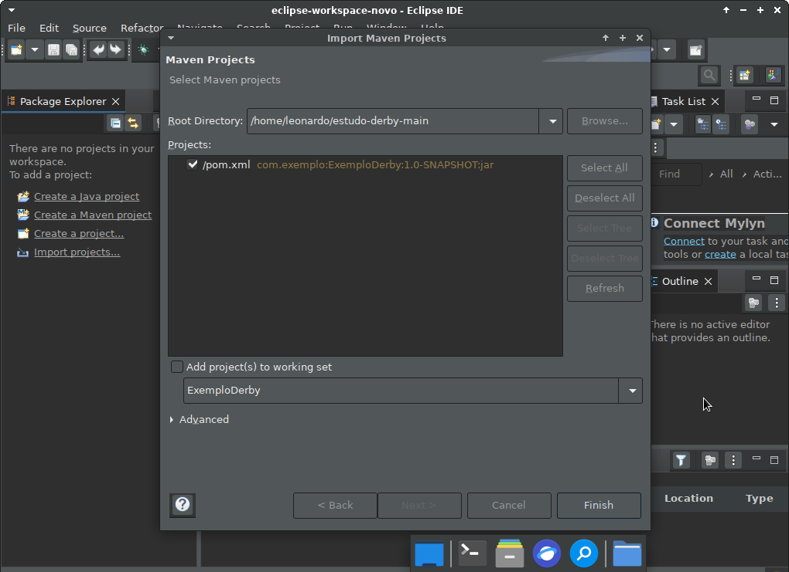

Repare que estou usando o JDK 17.

* Baixe os arquivos deste repositório (conforme a primeira imagem abaixo)
* Vá na pasta que você baixou o arquivo "estudo-derby-main.zip" e extraia usando o descompactador de sua preferência (pode ser o nativo do sistema).
* Abra o seu NetBeans (pode ser o ide java que você quiser)
* Selecione no menu arquivo (File)
* Em seguida abrir projeto (Open Project)
* Selecione a pasta na qual você baixou e fez a extração dos arquivos deste repositório

* Rode o projeto

  Usando o maven você não precisa se preocupar em baixar as dependências manualmente e possíveis conflitos de versões.
  Espero que isso te ajude.

  É um exemplo bem bobo e básico so cria uma tabela insere uns dados de exemplo e lista esses dados (tente dar uma melhorada nele , faça testes..
  Depois aprofunde e busque sobre PreparedStatements (Como evitar SQLInjection)

  Use a opção para baixar o zip do repositório ou use o git clone (se você já souber como usar o git no terminal)
  Observe a imagem abaixo:

  

  
  Projeto rodando:

  

  Aqui você pode observar as dependências usadas nesse projeto de exemplo (Viu como fica mais prático).
  Isso evita o trabalho de você ir em cada site baixar dependência por dependência. Tudo fica uniforme e garante que
  funcione em qualquer máquina (basta você ter o Java,o IDE de sua preferência e o Maven). Lembrando que o Maven geralmente vai instalado
  com o seu IDE.

  

  Rodando o projeto no estado atual dele, você obterá a seguinte saída:

  

  Faça testes, clique com o botão direito e remova algumas dependências , quebre o funcionamento do código observe as mensagens de erro.
  Aqui por exemplo eu reproduzi o erro que o professor relatou: (Eu forçei o erro removendo o driver do Derby)

  

  Outra vantagem é dispensar o uso de um IDE específico. Usando o Maven em qualquer ambiente de desenvolvimento que o suporte
  fica fácil reconstruir o projeto e rodar sem grande trabalho ou modificação. Aqui por exemplo estou rodando o mesmo projeto no IDE Eclipse.

  

  Projeto rodando no Eclipse. Repare que estou usando o mesmo código, as mesmas dependências, o mesmo arquivo pom.xml. O que mudou foi que estou
  usando um tema escuro no Eclipse ( minha visão agradece ). A saída em ambos os ambientes é exatamente a mesma.

  

